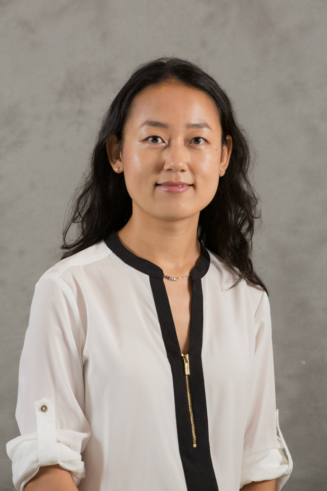

<link rel="stylesheet" href="styles.css" type="text/css">

I am a Post-Doctoral Researcher with the Center for Science, Technology, and Environmental Policy at the University of Minnesota's Humphrey School of Public Affairs. My research examines policies assisting with the transition to cleaner, more efficient energy systems using both economic theories and empirical methods. I am currently working with Prof. [Gabe Chan](https://chan-lab.umn.edu/gabe) to investigate what factors drive innovation in energy technologies and the role of spillovers in government investment. I am particularly interested in applying machine learning methods to policy evaluation to draw unique insights into heterogeneous policy effectiveness and how to improve program performance.  

I received my PhD in applied economics from the [University of Minnesota](https://www.apec.umn.edu/) in 2018, my MS from the same program in 2015, and my BA degree in economics from the [University of Minnesota-Morris](https://www4.morris.umn.edu/) in 2013. I am originally from Henan province, China and have lived in Minnesota since 2011.  

My two-page resume is available [here](files/BixuanSun-resume.pdf), and my full CV is available [here](files/BixuanSun-CV.pdf).